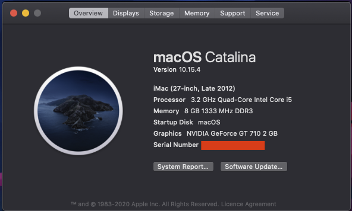

# Hackintosh Opencore 0.5.6 Installation Guide for HP8300 SFF i5 3470 - Catalina

### This guide is not intended for beginner

### Hardware

Type|Item
:----|:----
**Storage (macOS)** | [KINGSTON A400 256GB](https://shopee.com.my/product/29242218/1103855234)
**GPU** | [GT 710 2GB (GV-N710D3-2GL)](https://shopee.com.my/product/105136036/2721548636)
**WiFi + Bluetooth** | [BCM943602CS](https://www.aliexpress.com/item/32847834498.html) + [PCI-E Adaptor](https://shopee.com.my/product/162227071/3405707076)

### Step By Step Installation Guide

[STEP_BY_STEP.md](STEP_BY_STEP.md)

### What's Working/What's Not

##### Working
- Ethernet
- Onboard Audio
- HDMI Audio
- IGPU in headless mode
- App Store
- Wake/Sleep
- Restart
- Shutdown
- USB (Correct SS/HS speed)
- Dual monitor from boot
- Apple Music (iTunes)
- iMessage
- Facetime
- Handoff
- Airdrop
- Continuity
- AirPlay

##### Not Tested
- FileVault
- Power Nap

##### Not Working
- Netflix in Safari

##### Credit
- SSDTTime(for HPET) - https://github.com/corpnewt/SSDTTime