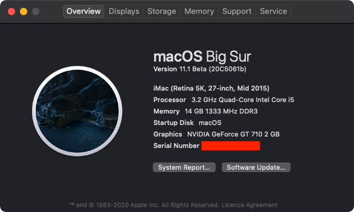

# Hackintosh Opencore 0.6.4 Installation Guide for HP8300 SFF i5 3470 - Big Sur

### This guide is not intended for beginner, you have been warned. No support is provided unless there is a valid issue. Please read everything before starting

### Hardware

Type|Item
:----|:----
**Storage (macOS)** | KINGSTON A400 256GB
**GPU** | GT 710 2GB (GV-N710D3-2GL)
**WiFi + Bluetooth** | BCM943602CS + PCI-E Adaptor

### Prerequisite 
Please understand all OpenCore configuration by reading [Configuration.pdf](https://github.com/acidanthera/OpenCorePkg/blob/master/Docs/Configuration.pdf) 

### Required Tools
- [GenSMBIOS](https://github.com/corpnewt/GenSMBIOS)
- [EFI-Agent](https://github.com/headkaze/EFI-Agent)
- [Hackintool](https://github.com/headkaze/Hackintool)

### Step By Step Installation Guide
1. [BIOS configuration](BIOS.md)
2. [macOS installation media](INSTALLER.md)
3. [OpenCore EFI](OC.md)
4. [Post Installation](POST_INSTALL.md)

### Extras
- [BCM943602CS WIN10 BT/WiFi Driver](https://mega.nz/file/h5ozUZCS#XVszB3yWDcyhaNxahbMWJLiEmnmGpqbuAnahyGDdv7Y)

### What's Working/What's Not

##### Working
- Ethernet
- Onboard Audio
- HDMI Audio
- IGPU in headless mode
- App Store
- Wake/Sleep
- Restart
- Shutdown
- USB (Correct SS/HS speed)
- Dual monitor from boot
- Apple Music (iTunes)
- iMessage
- Facetime
- Handoff
- Airdrop
- Continuity
- AirPlay

##### Not Tested
- FileVault
- Power Nap

##### Not Working
- Netflix in Safari

### Credit
- SSDTTime(for HPET) - https://github.com/corpnewt/SSDTTime
