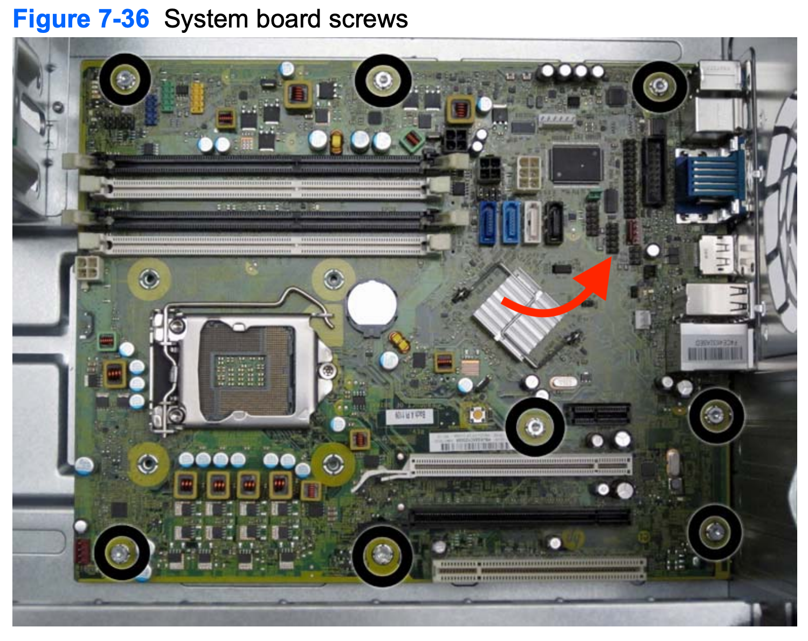

# Step By Step Installation Guide for Catalina >=10.15.2

## BIOS Settings

BIOS version: `00.03.06 Rev.A`

- Load Optimized Defaults
- Storage -> SATA emulation -> AHCI
- Storage -> Removable Media Boot -> Enabled
- Security -> Network Boot -> Disabled
- Secure Boot -> Legacy Support: Disabled
- Secure Boot -> Secure Boot: Disabled
- Secure Boot -> Fast Boot - Enabled


## Bluetooth Connection


## USB
- Format: Mac OS Extended.
- Schema: GUID Partition Map       

Follow Apple's instruction on how to use "createinstallmedia" command [https://support.apple.com/en-us/HT201372](https://support.apple.com/en-us/HT201372)

## Opencore EFI

### ACPI 
- SSDT-PM.aml `Generate your own PM using https://github.com/Piker-Alpha/ssdtPRGen.sh` - Not needed for USB installer
- SSDT-EC.aml
- SSDT-HPET.aml

### Driver
- VBoxHfs.efi
- FwRuntimeServices.efi
- OpenRuntime.efi

### Kext
- Lilu.kext
- VirtualSMC.kext
- WhateverGreen.kext
- AppleALC.kext - Compile from source for latest version, it has fix for AppleHDA race condition
- IntelMausi.kext
- USBPorts.kext - Use the included `USBPorts.kext`
- SMCProcessor.kext
- SMCSuperIO.kext

### config.plist
- Use the included `config.plist`

### For sleep to work properly
```
sudo pmset hibernatemode 0
sudo pmset proximity 0
```
